# 代码规范整理
<div class="sub-title">页面制作：@lxf&emsp; 创建于：2017.12.11&emsp; 最后更新：12.11 13:25</div>

## 纯PHP代码源文件只使用`<?php`，省略关闭标签`?>`

## 使用Tab键来缩进，每个Tab键长度设置为4个空格
>哪里设置？

## 关于业务
* Model层，只做简单的数据表的查询；
* 业务逻辑统一封装到 Logic层；
* 控制器只做URL路由，负责和页面交互，不要当作 业务方法 调用；
* 控制器层不能出现SQL操作语句 where()、order() 等模型方法，
即，控制器中，不要出现类似这样的SQL语句：`D('XXX')->where()->order()->limit()->find();`
`where()、order()、limit()` 等SQL方法只能出现在 Model层、业务层！

## 命名规范使用参考最开始的word文档
* 类名 使用大驼峰式（`StudlyCaps`）写法，并且文件名和类名一致，命名应当是名词；
* （类的）方法名 使用小写字母 + 下划线 写法，如 `function http_send_post()`，命名的应当是动词；
* 函数名  小写字母 + 下划线 写法，如 `public function http_send_post()`，命名的应当是动词；
* 变量名 小写字母 + 下划线写法，如 `$current_user`，命名的应当是名词；

## 关于类的写法
```
<?php
// extends和实现implement必须和 class name 写在一行
class Mysql extends ParentClass implements Itemplete { // 写一行，{ 前面有个空格
    //属性(property)必须声明其可见性，
    //到底是 public 还是 protected 还是 private，不能省略，
    //也不能使用var, var是php老版本中的什么方式，等用于public。
    public $foo = null;
    private $name = 'yangyi';
    protected $age = '17';

    // 参数之间有一个空格。默认参数的“=”左右各有一个空格，) 与 { 之间有一个空格
    // 方法(method)，必须 声明其可见性，到底是 public 还是 protected 还是 private，不能省略。
    // 如果有多个参数，第一个参数后紧接“,” ，再加一个空格：function_name($par, $par2, $pa3),
    // 如果参数有默认值，“=”左右各有一个空格分开
    public function get_info($name, $age, $gender = 1) {
        // 参数之间有一个空格。默认参数的“=”左右各有一个空格，) 与 { 之间有一个空格

    }
}
```
>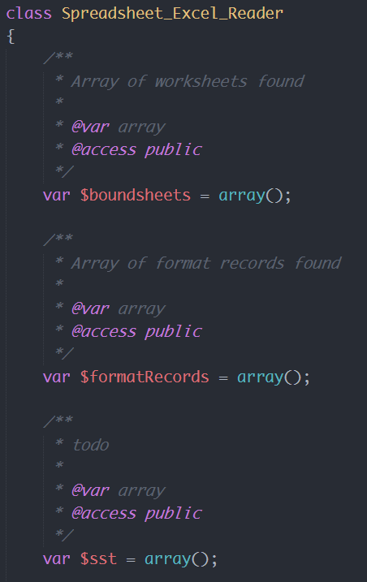

```
<?php
// 用到抽象(abstract)和终结(final)来做类声明时，
// 它们必须放在方法可见性声明 （public 还是protected还是private）的前面。
// 而当用到静态(static)来做类声明时，则必须放在可见性声明的后面。
abstract class ClassName {
    protected static $foo; // static放后面
    abstract protected function zim(); // abstract放前面

    final public static function bar() { // final放前面，static放最后。
        // 方法主体部分
    }
}
```
>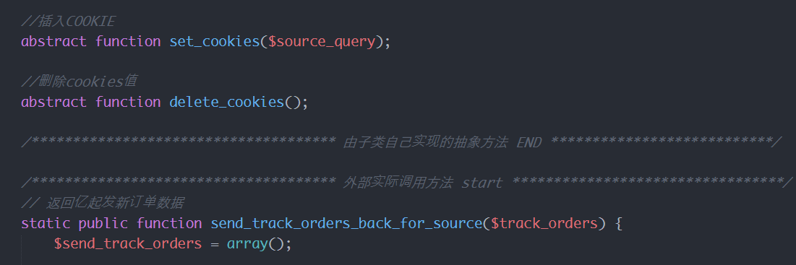


## 控制语句的规范
* if控制语句

```
<?php
if ($expr1) { // if 与 ( 之间有一个空格，) 与 { 之间有一个空格

} elseif ($expr2) { // elesif 连着写，与 ( 之间有一个空格，) 与 { 之间有一个空格

} else { // else 左右各一个空格

}
```
>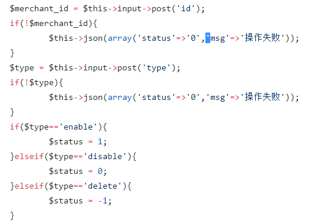


* switch控制语句

```
<?php
switch ($expr) { // switch 与 ( 之间有一个空格，) 与 { 之间有一个空格
    case 0:
        echo 'First case, with a break'; // 对齐
        break; // 换行写break，也对齐。
    case 1:
        echo 'Second case, which falls through';
        // no break
    case 2:
    case 3:
    case 4:
        echo 'Third case, return instead of break';
        return;
    default:
        echo 'Default case';
        break;
}
```
>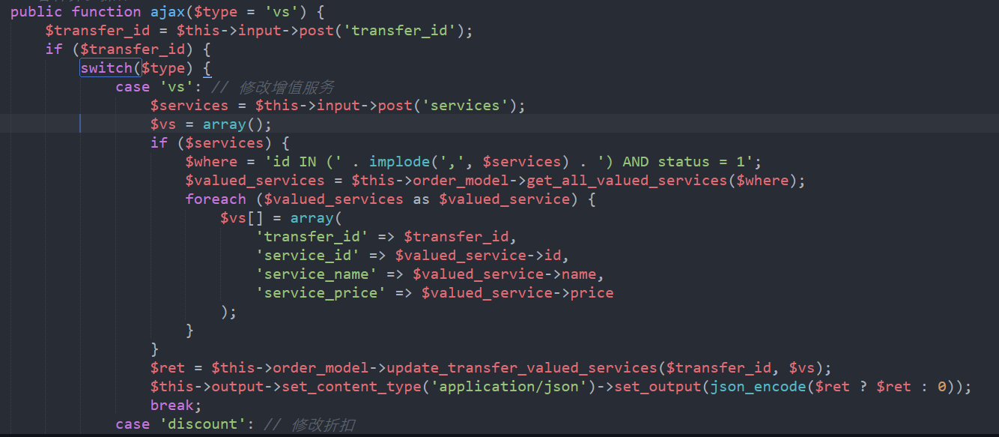


* 循环

```
<?php
for ($i = 0; $i < 10; $i++) {
    // for 与 ( 之间有一个空格，二元操作符 "="、"<" 左右各有一个空格，) 与 { 之间有一个空格

}
foreach ($iterable as $key => $value) {
    // foreach 与 ( 之间有一个空格，"=>" 左右各有一个空格，) 与 { 之间有一个空格

}
try { // try 右边有一个空格

} catch (FirstExceptionType $e) {
    // catch 与 ( 之间有一个空格，) 与 { 之间有一个空格

} catch (OtherExceptionType $e) {
    // catch 与 ( 之间有一个空格，) 与 { 之间有一个空格

}
```
>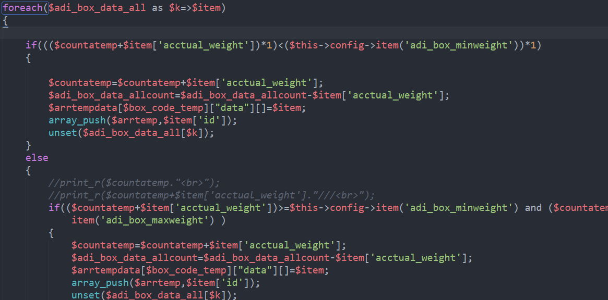
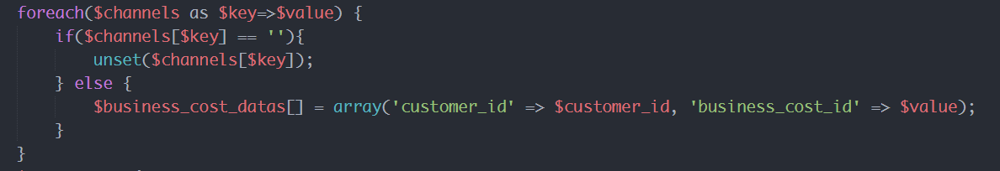


## 关于空格的使用
* 赋值操作符（=，+= 等）、逻辑操作符（&&，||）、等号操作符（==，!=）、关系运算符（<，>，<=，>=）、按位操作符（&，|，^）、连接符（.） 左右各有一个空格；

>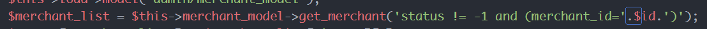
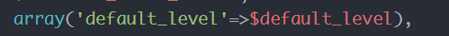


* if，else，elseif，while，do，switch，for，foreach，try，catch，finally 等 与 紧挨的左括号“(”之间有一个空格；
函数、方法的各个参数之间，逗号（","）后面有一个空格；

>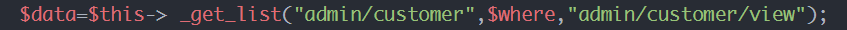
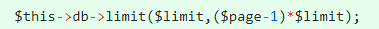


## 关于空行的使用
* 所有左花括号 { 都不换行，并且 ｛ 紧挨着的下方，一定不是空行；
* 同级代码（缩进相同）的 注释（行注释/块注释）前面，必须有一个空行；（用以形成段落表明以下内容为一段）
* 各个方法/函数 之间有一个空行；
* 如果 return 语句之前只有一行PHP代码，return 语句之前不需要空行；
* 如果 return 语句之前有至少二行PHP代码，return 语句之前加一个空行；
* if，while，switch，for，foreach、try 等代码块之间 以及 与其他代码之间有一个空行；
* **综上述一个段落的意思表达完了都应该空一行**

>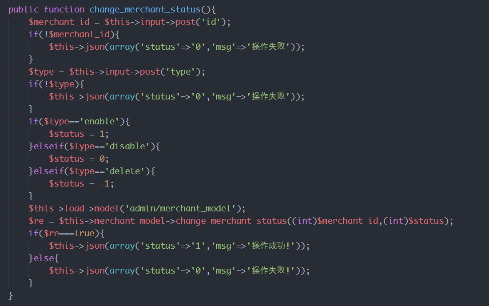


## 关于错误抑制符@ `禁用@`
>
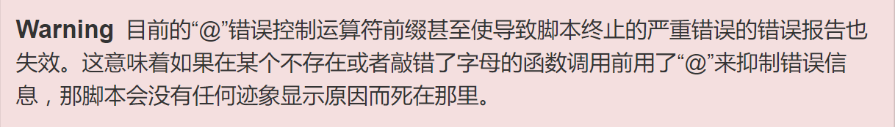


### 参考：
[PHP团队 编码规范 & 代码样式风格规范](https://www.cnblogs.com/52php/p/5841210.html)
[PHP中PSR-[0-4]代码规范](http://www.cnblogs.com/52php/p/5852572.html)

---

##  如何命名规范
* 类的名称一般是名词，而方法的名称一般是动词或动词短语，其参数为名词
* 命名应当表达：它为什么存在，用来做什么，怎么用
* 用名字表达变量所代表的是什么，不包含晦涩的缩写，同时也没有歧义(命名的名字跟概念相似所以容易记忆)
* 不要使用反逻辑来为编程命名
`IsEnabled  IsNotEnabled`
`if (!(isAdmin || isUser)) if(!isAdmin && !isUser)`
* Total、 Sum、 Average、 Max、 Min、 Record、 String、 Pointer 这样的表示计算结果的词语修饰某个变量时，请记住放在最后面
`transfer_total, total_sum, freight_max`

* 为循环下标命名
>i, j, k只能适用在非常简单的循环里，最多只能有几行。而且只能在循环之内用。所以尽可能的用比i, j, k更具体更形象的名字来命名。
* 统一单词的连接都是下滑线
* 布局命名规范
>安平
* 常规属性的命名，lnk_ , btn_ , radio_, checkbox_，
* j_这种命名可以 `j_btn_add_channel, j_lnk_show_content`

## 使用变量
* 声明的时候初始化话变量
* 在靠近初次使用变量的时候初始化变量
* 在理想的情况下，在靠近初次使用变量的位置声明和定义该变量
> 声明制定了该变量的类型，定义为变量指定了特定的取值


### 参考
[编程时好的命名规则学习](http://blog.chinaunix.net/uid-26914516-id-3375454.html)
[编程命名规则](https://www.2cto.com/kf/201211/167047.html)
[变量名的力量](http://blog.csdn.net/AndyNikolas/article/details/54773529)
代码整洁之道


