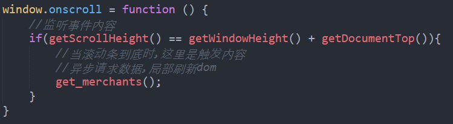
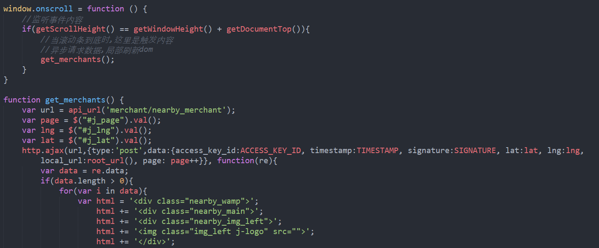
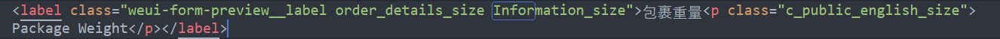
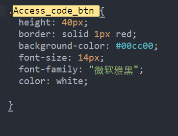
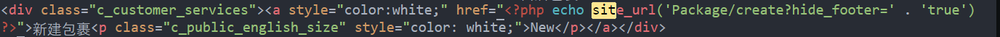
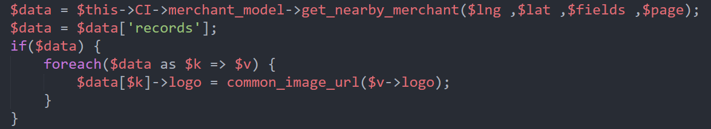

# W2017-12-25周会安排

页面制作：@lxf&emsp; 创建于：2017.12.24&emsp; 最后更新：12.24 13:25

## 1. 代码码规范执行情况review
* if foreach for写法
* css 样式大小写
* 统一链接的写法都是小写
>

## 2. 上周执行结果回馈
* <code>git stash</code>命令的运用
    > 缩短周会时间，余林月会分享

* 继续讨论如何复用检查是否登陆的方法

## 3. 个人分享
* 陈喆一个微信相关的问题

## 4. 有单独项目的汇报项目进度
* 各自项目安排的介绍

## 5. 讨论上周遇到的问题
* EDK本次开发上线的问题
* `foreach($data)`这个`$data`

## 6. 本周安排规划

